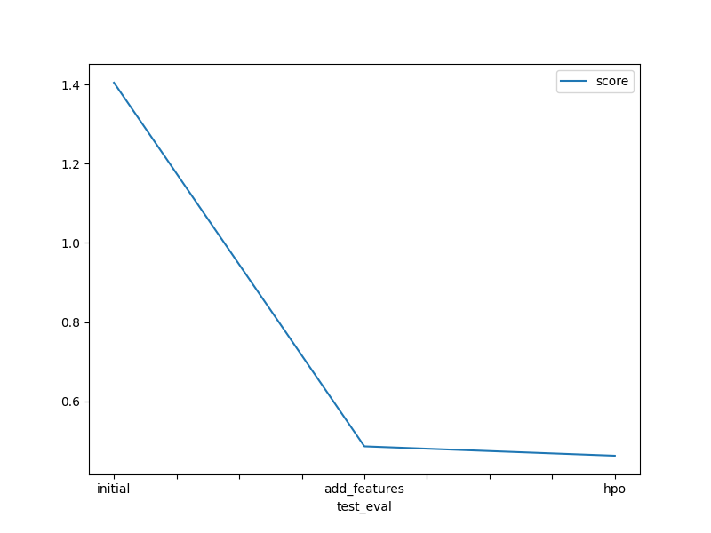

# Report: Predict Bike Sharing Demand with AutoGluon Solution
#### Rodolfo Pinheiro da Cruz

## Initial Training
### What did you realize when you tried to submit your predictions? What changes were needed to the output of the predictor to submit your results?
The model produced some negative predictions, which I adjusted by setting all negative values to zero.

### What was the top ranked model that performed?
WeightedEnsemble_L3

## Exploratory data analysis and feature creation
### What did the exploratory analysis find and how did you add additional features?
The features season and weather are categorical but were being treated as integers, so I converted them to categorical. In addition, there was a feature called datetime that contained information about year, month, day, and hour. I separated this information and created four new features: year, month, day, and hour.

### How much better did your model preform after adding additional features and why do you think that is?
The Kaggle score improved from 1.40502 to 0.48586, an improvement of approximately 65%. This improvement resulted from converting the categorical features, which had been treated as integers, into their correct data type, and from splitting the datetime feature into four new features. These additional features provided more information and helped the model capture the seasonality of bike-sharing demand.

## Hyper parameter tuning

### How much better did your model preform after trying different hyper parameters?
The Kaggle score decreased from 0.48586 to 0.46476, an improvement of approximately 4.3%.

### If you were given more time with this dataset, where do you think you would spend more time?
I would try running AutoGluon for a longer period in order to explore a broader set of hyperparameters.

### Create a table with the models you ran, the hyperparameters modified, and the kaggle score.
|model|hpo1|hpo2|hpo3|score|
|--|--|--|--|--|
|initial|default|default|default|1.40502|
|add_features|default|default|default|0.48586|
|hpo|LightGBM (GBM) : learning_rate: space.Categorical(0.01, 0.05, 0.1),num_leaves: space.Int(31, 50), feature_fraction: space.Real(0.8, 1.0), bagging_fraction: space.Real(0.8, 1.0),min_data_in_leaf: space.Int(20, 50)|ExtraTrees (XT): n_estimators: space.Int(50, 300), max_depth: space.Int(5, 15), max_features: space.Real(0.5, 1.0),|CatBoost (CAT): learning_rate: space.Categorical(0.01, 0.05, 0.1), depth: space.Int(4, 6), l2_leaf_reg: space.Int(1, 5), bagging_temperature: space.Real(0, 1)|0.46222|

### Create a line plot showing the top model score for the three (or more) training runs during the project.

TODO: Replace the image below with your own.

### Create a line plot showing the top kaggle score for the three (or more) prediction submissions during the project.

TODO: Replace the image below with your own.

## Summary
- AutoGluon was used in the project to predict bike-sharing demand. With just a few lines of code, it trained several machine learning models and combined them into ensembles;
- The conversion of two features to their correct data types (from integers to categorical) and the creation of four new features led to a performance improvement of nearly 66%. The new features were generated by extracting the day of the month, hour, month, and year from the datetime feature, which originally condensed all this information into a single variable.